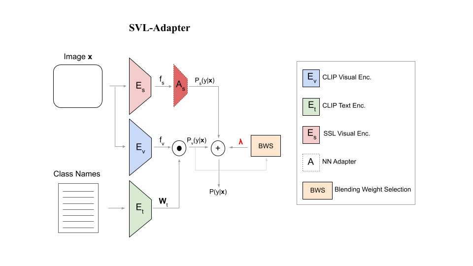

# SVL-Adapter: Self-Supervised Adapter for Vision-Language Pretrained Models
Official implementation of SVL-Adapter, presented in our BMVC 2022 [paper](https://arxiv.org/abs/2210.03794). A summary video can be found [here](https://www.youtube.com/watch?v=_5IpSSpZHAY).



## Quantitative Results
[Here](https://docs.google.com/spreadsheets/d/1_d7nvKM4xlc1ryI8yk1yiI_KrY0t0P3qYaeuBL3__w8/edit?usp=sharing) you can find the numerical results of the low-shot and zero-shot evaluation of SVL-Adapter across all datasets explored. The numbers correspond to Figures 3 and 4 of the paper.


## Prerequisites

### Set up Environment
We start by creating a conda environment with the required dependencies.

```
git clone https://github.com/omipan/svl_adapter/

# Create conda environment
conda create -n svl_adapter python=3.8
conda activate svl_adapter

# Install Requirements
pip install -r requirements.txt
conda install pytorch torchvision cudatoolkit

# Install CLIP
pip install git+https://github.com/openai/CLIP.git
```

### Fetch Datasets
Follow [DATASET.md](https://github.com/omipan/svl_adapter/blob/main/DATASET.md) for instructions on setting up the 16 datsets of the paper. Data loading follows the detailed procedure described in the [CoOp](https://github.com/KaiyangZhou/CoOp) repository. We thank its authors for their great work.


## Data Preparation
First, we generate a metadata file with common format across datasets to handle data across all stages (self-supervised pretraining, low-shot learning etc.)
```
python data_preparation.py --dataset eurosat
```

## Self-Supervised Learning Pretraining
We train a self-supervised learning model (here SimCLR) given the images that are available for each task at hand:
```
python  ssl_pretraining.py --train_loss simclr --backbone resnet50 --dataset eurosat --output_dir data/eurosat/ssl_pretraining/models/
```


## Low-Shot Learning

### Feature Extraction
We extract features from the self-supervised pretrained model and CLIP visual encoders for any given dataset only once to save time during low-shot adaptation. We should note that these features are kept frozen during training of SVL-Adapter. For SSL features we run:

```
python feature_extraction.py --dataset 'eurosat'  --model_type 'ssl'  --model_subtype 'RN50' --feature_path 'data/eurosat/pretrained_features/'  --model_dir 'data/eurosat/ssl_pretraining/models/'
```
and for CLIP visual features:
```
python feature_extraction.py --dataset 'eurosat'  --model_type 'clip' --model_subtype 'RN50' --feature_path 'data/eurosat/pretrained_features/'
```

### SVL-Adapter and SVL-Adapter* for Low-Shot Learning

Given the features extracted with the self-supervised learning (i.e. SimCLR) encoder trained with the data of the given task and features from the general CLIP visual encoder, we train our SVL-Adapter model:
```
python low_shot_adapt.py --dataset 'eurosat' --feature_path 'data/eurosat/pretrained_features/' --pretrained_model 'simclr_RN50' --finetune_type 'mlp_adapter' --epochs 50 --tune_alpha
```

Similarly, to train SVL-Adapter*, the version of SVL-Adapter that does not need an additional validation set to decide on the balancing parameter between CLIP and Self-Supervised Learning Adapter, we run the following:

```
python low_shot_adapt.py --dataset 'eurosat'  --feature_path 'data/eurosat/pretrained_features/' --pretrained_model 'simclr_RN50' --finetune_type 'mlp_adapter' --epochs 50 --confidence_alpha
```

## Zero-Shot Learning
For zero-shot learning, we suggest exploitation of Zero-Shot CLIP to generate pseudolabels for SVL-Adapter* and treat similarly with Low-Shot Learning.


### Generate metadatafile that uses pseudolabeled data during low-shot adaptation
Initially, we generate a metafile that considers the pseudolabels (zero-shot predictions) of CLIP as the ground truth labels that are going to be used during the adaptation stage. In the example below, we keep the 16 most confident pseudolabels for each of the predicted categories. 

```
python generate_clip_pseudolabels.py --dataset eurosat --model_subtype RN50 --imgs_per_label 16
```

### Feature Extraction
Again, we extract features from the self-supervised pretrained model and CLIP visual encoders for low-shot adaptation but now the training set is replaced with images and their pseudolabels as generated by CLIP.

```
python feature_extraction.py --dataset 'eurosat'  --model_type 'ssl' --model_subtype 'RN50' --feature_path 'data/eurosat/pretrained_features/' --use_pseudo --pseudo_conf '16shot' --pseudolabel_model 'clip_RN50' --model_dir 'data/eurosat/ssl_pretraining/models/'
```

```
python feature_extraction.py --dataset 'eurosat'  --model_type 'clip' --model_subtype 'RN50' --feature_path 'data/eurosat/pretrained_features/' --use_pseudo --pseudo_conf '16shot' --pseudolabel_model 'clip_RN50'
```
### SVL-Adapter* for Zero-Shot Learning
```
python zero_shot_pseudo_adapt.py --dataset 'eurosat' --feature_path 'data/eurosat/pretrained_features/' --pretrained_model 'simclr_RN50'  --pseudolabel_model 'clip_RN50' --pseudo_conf '16shot' --finetune_type 'mlp_adapter'
```

## Reference
If you find our work useful in your research please consider citing our paper:
```
@inproceedings{svladapterbmvc2022,
    author    = {Pantazis, Omiros and Brostow, Gabriel and Jones, Kate and Mac Aodha, Oisin},
    title     = {SVL-Adapter: Self-Supervised Adapter for Vision-Language Pretrained Models},
    booktitle = {British Machine Vision Conference (BMVC)},
    year      = {2022}
}
```
## Acknowledgements
This codebase has benefited from [CLIP](https://github.com/openai/CLIP), [CoOp](https://github.com/KaiyangZhou/CoOp) and [FocusOnThePositives](https://github.com/omipan/camera_traps_self_supervised) GitHub repositories.
